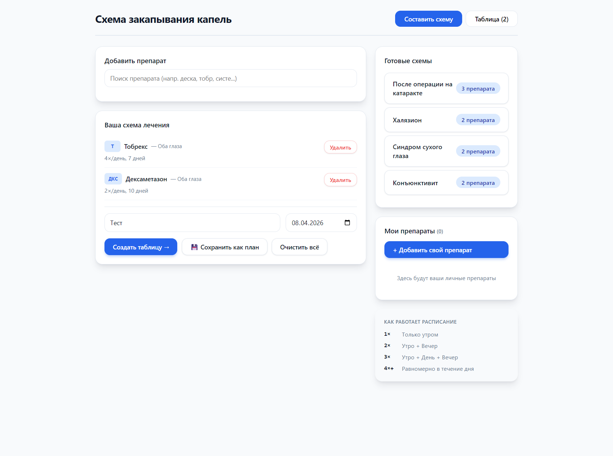
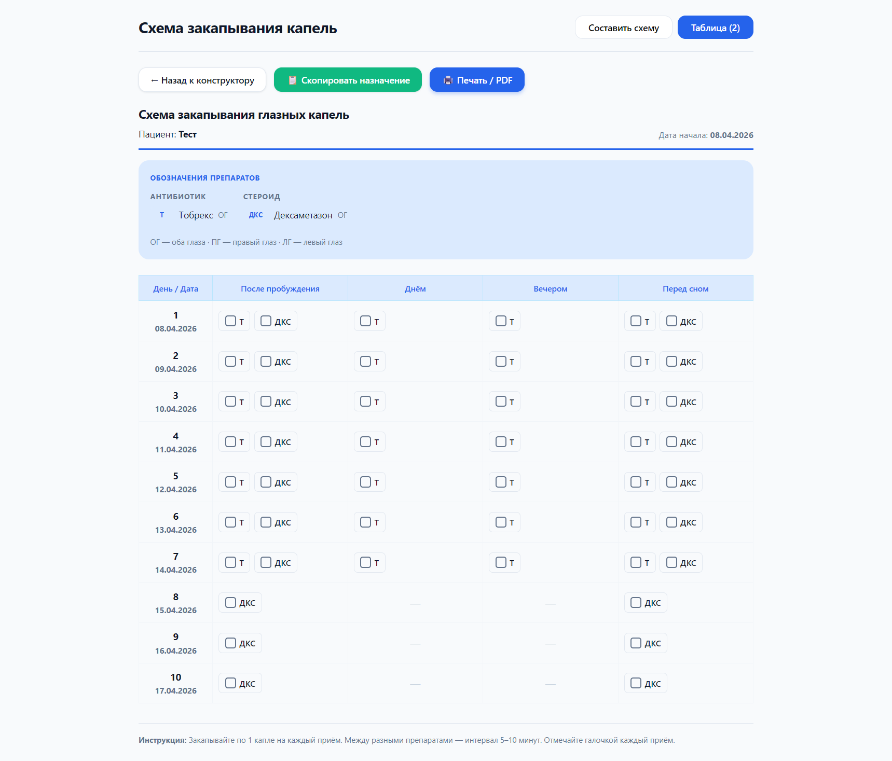

# 💧 OphtaPlan — схема закапывания глазных капель

Одностраничное веб-приложение, которое помогает пациенту после офтальмологической
операции не запутаться в каплях: собираете схему лечения — получаете наглядное
расписание, которое можно распечатать и повесить на холодильник.

**🌐 Попробовать: [ophthaplan.netlify.app](https://ophthaplan.netlify.app)**

Всё работает в браузере, без сервера и без установки — один файл `index.html`.

## Как это выглядит

Конструктор схемы — препараты, частота, длительность, готовые протоколы:

Итоговая таблица-расписание с чекбоксами на каждый приём (печать / PDF одной кнопкой):

## Возможности

- 📋 **Конструктор схемы** — препараты, длительность и частота, в том числе
  убывающие схемы («7 дней × 4 раза → 7 дней × 3 раза → …»).
- 💊 **Справочник препаратов** с короткими аббревиатурами + свои препараты.
- 📑 **Готовые схемы** — типовые протоколы (после операции на катаракте, халязион,
  синдром сухого глаза, конъюнктивит), можно сохранять свои.
- 🗓 **Наглядная таблица-расписание** по дням и времени закапывания,
  с отметкой «оба глаза / правый / левый».
- 🖨 **Печать / PDF** — версия для печати одной кнопкой.
- 💾 Всё сохраняется локально в браузере (localStorage) — никакие данные
  никуда не отправляются.

## Запуск

Открыть [ophthaplan.netlify.app](https://ophthaplan.netlify.app) — или просто
`index.html` в любом современном браузере.

## Стек

Чистый HTML + CSS + JavaScript, без зависимостей и сборки. Хостинг: Netlify.

---

> ⚠️ Приложение — вспомогательный планировщик, а не медицинская рекомендация.
> Схему лечения назначает врач.
